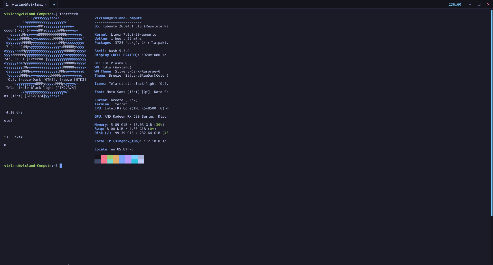

<p align="center">
  
</p>

<h1 align="center">TerraTerminal (<code>terrat</code>)</h1>

<p align="center">
  <b>A lightweight, high-performance minimalist terminal emulator for Linux and Windows, written in pure Go.</b>
  <br>
  <i>Zero CGO &bull; Sub-5ms Cold Boot &bull; ~11MB Idle RAM &bull; Single Static Binary &bull; v0.2.5</i>
</p>

<p align="center">
  <a href="#overview">Overview</a> &bull;
  <a href="#features">Features</a> &bull;
  <a href="#keyboard-shortcuts">Shortcuts</a> &bull;
  <a href="#cli-usage">CLI Usage</a> &bull;
  <a href="#configuration">Configuration</a> &bull;
  <a href="#installation--building">Installation</a> &bull;
  <a href="#benchmarks">Benchmarks</a> &bull;
  <a href="#license">License</a>
</p>

<p align="center">
  
</p>

---

## Overview

Most terminal emulators fall into two extremes:
1. **Web-bloated applications** (Electron, WebAssembly, heavy webviews) consuming 200MB–400MB of RAM just to render a prompt.
2. **Legacy C/C++ terminals** entangled with complex dynamic linkers, fragile CGO bindings, or sprawling external dependencies.

**TerraTerminal (`terrat`)** is engineered for minimal resource consumption and zero-friction deployment:
- **100% Pure Go:** Directly interfaces with the Linux X11 display server via the raw wire protocol (`xgb`) and with Windows through native ConPTY. Requires zero CGO and zero external C libraries.
- **Cross-Platform:** Native execution on **Linux** (X11 / XWayland across GNOME, KDE, XFCE, i3, Sway, Hyprland) and **Windows 10/11** with intelligent shell detection (Git Bash, WSL, PowerShell, CMD).
- **Near-Instant Cold Boot:** Launches and renders the first frame in under **5 milliseconds**.
- **Flyweight Memory Footprint:** Idles at approximately **~11MB RSS** during daily workflows.
- **Tear-Free Double Buffering:** Server-side pixmap double-buffering eliminates visual tearing and resizing artifacts.

---

## Features

### 1. Client-Side Window Frame (CSD) & Multi-Theme Controls
- Integrated titlebar with 1px hairline boundary and live dimensions micro-HUD (e.g. `80x24`).
- Clean right-aligned controls for Settings, Minimize, Maximize, and Close.
- Full custom-themed titlebar button rendering (including retro block-art for the Minecraft theme).
- 8-direction interactive border resizing with directional cursor morphing.

### 2. Isolated Multi-Tab Architecture
- Fully isolated tabs: each tab runs its own pseudo-terminal (PTY) instance, terminal state machine, and dedicated I/O pump with cancellation contexts to eliminate goroutine leaks.
- Tab pills display live process names (`bash`, `nvim`, `htop`, etc.).
- Intuitive mouse controls: switch tabs, close individual tabs via `×`, or spawn sessions with `+`.
- Clean process exit handling: exiting the active shell terminates the tab; closing the final tab cleanly exits the application.

### 3. Real-Time Font Scaling & Glyphs
- Dynamic font scaling with `Ctrl+=` / `Ctrl+-` or `Ctrl + MouseWheel`.
- In-memory glyph caching with instant sub-millisecond rasterization.
- Automatic PTY window recalculation with `SIGWINCH` propagation.

### 4. Interactive In-Buffer Search
- Minimalist floating search bar toggled with `Ctrl+Shift+F`.
- Live visual match highlighting:
  - **All matches:** Warm amber glow.
  - **Active match:** Vivid emerald highlight.
- Real-time match counter with `Enter` (next) and `Shift+Enter` (previous) navigation.

### 5. Curated Themes & System Dark Mode
- Preferences modal toggled via `Ctrl+,` or `Ctrl+Shift+P`.
- Built-in color schemes:
  - **Tokyo Night** (Dark)
  - **Catppuccin Mocha** (Dark)
  - **Minecraft** (Dark custom palette)
  - **Tokyo Day** (Light)
  - **Solarized Light** (Light)
  - **Auto** (Synchronizes with OS desktop theme via DBus / Desktop Portal)

### 6. Live Command Diagnostics & Typo Linter
- Integrated lexical state-machine parser (`diagnostics/lexer.go`) supporting quotes, escapes, and chained operators (`&&`, `||`, `;`, `|`).
- Detects unrecognized commands (`gti` &rarr; `git`, `sl` &rarr; `ls`, `mkae` &rarr; `make`), unknown subcommands (`git puch` &rarr; `git push`), unclosed quote strings, and commands requiring root privileges.
- Press **`Alt + Enter`** to automatically apply the recommended QuickFix directly to the active prompt.

### 7. Fish-Style Ghost Autocomplete
- Subtle inline suggestions rendered directly ahead of the cursor.
- Automatically reads shell histories (`~/.bash_history`, `~/.zsh_history`) and session commands.
- Press **`Tab`** or **`Right Arrow`** to accept the suggestion.

### 8. Hardened Clipboard & Safe Paste
- Block text selection with word (double-click) and row (triple-click) matching.
- **Smart Ctrl+C / Ctrl+V:** `Ctrl+C` copies when text is selected or sends `SIGINT` when unselected. `Ctrl+V` pastes in normal shell mode while remaining transparent in fullscreen editors (`vim`, `nano`).
- **Bracketed Paste (DECSET 2004):** Wraps pasted text in escape markers to prevent broken indentation in REPLs.
- **Anti-Pastejacking Sanitization:** Strips malicious control codes, dangerous escapes, and bidirectional overrides while fully preserving legitimate Unicode characters like Persian ZWNJ (`\u200C`).

---

## Keyboard Shortcuts

### Navigation & Tabs
| Shortcut | Action |
| :--- | :--- |
| `Ctrl + Shift + T` | Open new tab |
| `Ctrl + Shift + W` | Close active tab |
| `Ctrl + Tab` / `Ctrl + PageDown` | Switch to next tab |
| `Ctrl + Shift + Tab` / `Ctrl + PageUp` | Switch to previous tab |
| `Alt + 1` .. `Alt + 9` | Jump directly to tabs 1 through 9 |

### Clipboard & Selection
| Shortcut | Action |
| :--- | :--- |
| `Ctrl + Shift + C` *(or `Ctrl + C` with selection)* | Copy selected text to clipboard |
| `Ctrl + Shift + V` / `Shift + Insert` | Paste text from clipboard |
| `Ctrl + Shift + A` | Select entire terminal buffer |
| `Middle Click` | Paste from X11 `PRIMARY` selection |

### Diagnostics & Search
| Shortcut | Action |
| :--- | :--- |
| `Alt + Enter` | Apply recommended Diagnostic QuickFix |
| `Ctrl + Shift + D` | Toggle Live Command Diagnostics |
| `Tab` / `Right Arrow` | Accept inline Ghost Text completion |
| `Ctrl + Shift + F` | Toggle in-buffer search bar |
| `Enter` / `Shift + Enter` | Next / previous search match |
| `Esc` | Close search bar or preferences modal |
| `Ctrl + Left Click` | Open hovered URL in default browser |

### View & Font Zoom
| Shortcut | Action |
| :--- | :--- |
| `Ctrl + =` / `Ctrl + +` | Increase font size by 1pt |
| `Ctrl + -` / `Ctrl + _` | Decrease font size by 1pt |
| `Ctrl + 0` | Reset font size to default (13pt) |
| `Ctrl + Wheel Up / Down` | Zoom in / out with mouse wheel |
| `Shift + PageUp / PageDown` | Scroll terminal viewport up / down |
| `Ctrl + ,` / `Ctrl + Shift + P` | Open / close Preferences modal |

---

## CLI Usage

```bash
terrat [flags] [-e command [args...]]
```

### Options
| Flag | Description | Default |
| :--- | :--- | :--- |
| `-v`, `-version` | Print version information and exit | `false` |
| `-title <string>` | Set initial window title | `TerraTerminal` |
| `-font-size <float>` | Override font size in points | *(config)* |
| `-theme <string>` | Color theme (`tokyo-night`, `catppuccin-mocha`, `minecraft`, `tokyo-day`, `solarized-light`) | *(config)* |
| `-shell <path>` | Override default shell binary (e.g. `bash`, `wsl.exe`, `powershell.exe`) | *(system)* |
| `-e <cmd...>` | Execute a custom command directly instead of the default shell | &mdash; |

### Examples
```bash
# Launch with custom font size and theme
terrat -font-size 15 -theme catppuccin-mocha

# Run a dedicated tool directly
terrat -e htop
terrat -e nvim /path/to/file
```

---

## Configuration

Settings are saved automatically in `~/.config/terrat/config.json` (or `%APPDATA%\terrat\config.json` on Windows):

```json
{
  "shell": "",
  "theme": "auto",
  "font_size": 13.0,
  "opacity": 0.95,
  "ghost_text": true,
  "diagnostics": true,
  "sanitize_paste": true,
  "bracketed_paste": true
}
```

---

## Benchmarks

Tested on Linux 6.x (X11 / Pure Go runtime):

| Metric | TerraTerminal (`terrat`) | Typical Desktop Terminal (Konsole / GNOME Terminal) |
| :--- | :--- | :--- |
| **Cold Startup Time** | **~4.6 ms** | ~40 – 120 ms |
| **Idle Memory (RSS)** | **~11 MB** | ~120 – 170 MB *(12x–15x heavier)* |
| **Idle CPU Usage** | **0.00%** *(Kernel epoll sleep)* | 0.2% – 1.5% |
| **Binary Footprint** | **~4.1 MB** *(Self-contained)* | Shared multi-MB UI runtime dependencies |
| **Runtime Requirements** | **Zero CGO / Pure Go** | Qt, GTK, or WebEngine runtime stacks |

---

## Installation & Building

### Prerequisites
- **Linux:** X11 server or Wayland via XWayland.
- **Windows:** Windows 10 or 11 (build 1809+ for ConPTY).
- **Go 1.22+** (only required if compiling from source).

### Building from Source

```bash
# Clone the repository
git clone https://github.com/vixland4509/Terrat.git
cd Terrat

# Compile optimized static binary
make build

# Run
./terrat

# Optional: Install to ~/go/bin with desktop entry
make install
```

### Running Tests & Static Analysis

```bash
# Run unit and race detection test suite
go test -race -count=1 ./...

# Run static analysis
go vet ./...

# Cross-compile check for Windows
GOOS=windows go vet ./...
```

---

## License

TerraTerminal is open source under the [GNU General Public License v3.0 (GPLv3)](LICENSE).
